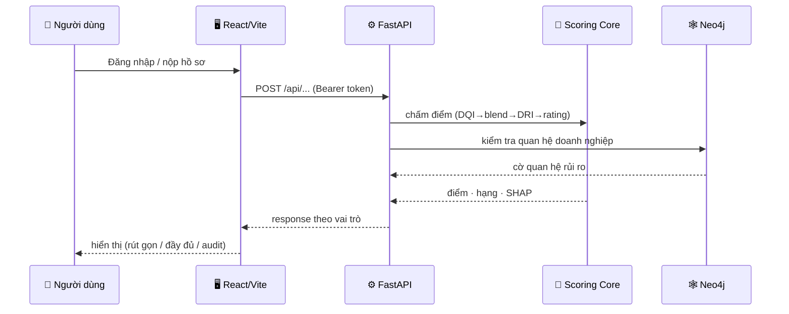
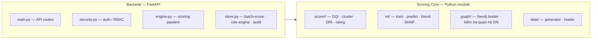

# ScoreSight — Kiến trúc tổng thể hệ thống

> Nền tảng chấm điểm tín dụng MSME bằng **dữ liệu phi truyền thống**.
> Hợp nhất **Scoring Core + Graph** (Python · ML · Neo4j) và **Platform** (FastAPI · React)
> thành một hệ thống end-to-end. Tài liệu dành cho present — tập trung kiến trúc & công nghệ.

---

## 1. Sơ đồ kiến trúc tổng thể

```mermaid
flowchart TB
    subgraph USERS["👥 NGƯỜI DÙNG — 3 vai trò"]
        direction LR
        U1["🏢 Doanh nghiệp"]
        U2["🏦 Cán bộ ngân hàng<br/>RM / CBTĐ"]
        U3["🛡️ Quản trị & Kiểm toán"]
    end

    subgraph FE["🖥️ FRONTEND — React 18 · Vite 5 · React Router 6"]
        direction LR
        P1["Customer Portal<br/>kết quả rút gọn"]
        P2["Bank Portal<br/>điểm · hạng · lý do"]
        P3["Admin Portal<br/>SHAP · rule engine · audit"]
    end

    subgraph API["⚙️ BACKEND API — FastAPI · Uvicorn · Pydantic"]
        direction LR
        AUTH["Auth & RBAC<br/>token · phân quyền"]
        ROUTES["API routes<br/>response theo vai trò"]
        GOV["Rule engine + Audit log<br/>maker-checker"]
    end

    subgraph PROC["🧮 TẦNG XỬ LÝ — Python · scikit-learn"]
        direction TB
        subgraph CORE["Scoring Core"]
            direction LR
            DQI["DQI<br/>chất lượng dữ liệu"]
            CL["Cluster<br/>phân nhóm"]
            ML["Stacked Blend<br/>LightGBM + CatBoost/Ridge"]
            DRI["DRI<br/>chiết khấu tin cậy"]
            CAL["Calibration<br/>master scale + hạng"]
            SHAP["SHAP<br/>giải thích"]
            DQI --> CL --> ML --> DRI --> CAL --> SHAP
        end
        subgraph REL["Kiểm tra quan hệ DN — Cypher"]
            GF["Sở hữu chéo · Chung địa chỉ · Giao dịch vòng"]
        end
    end

    subgraph DB["🗄️ TẦNG DATABASE / STORAGE"]
        direction LR
        LAKE["📦 Data Lakehouse — medallion<br/>bronze/silver/gold · pandas · pyarrow"]
        N4J["🕸️ Neo4j Graph Database<br/>(Aura)"]
        REG["🧰 Model Registry<br/>*.pkl · joblib"]
    end

    USERS --> FE
    FE -->|"HTTPS /api/* · Bearer token"| API
    API --> CORE
    API --> REL
    CORE --> LAKE
    CORE --> REG
    REL --> N4J

    classDef users fill:#FFF3E0,stroke:#F56B29,color:#0F1B2D
    classDef fe fill:#E3F2FD,stroke:#1976D2,color:#0F1B2D
    classDef api fill:#F3E5F5,stroke:#7B1FA2,color:#0F1B2D
    classDef core fill:#E8F5E9,stroke:#2E7D32,color:#0F1B2D
    classDef graph fill:#FCE4EC,stroke:#C2185B,color:#0F1B2D
    classDef data fill:#ECEFF1,stroke:#455A64,color:#0F1B2D
    class U1,U2,U3 users
    class P1,P2,P3 fe
    class AUTH,ROUTES,GOV api
    class DQI,CL,ML,DRI,CAL,SHAP,GF core
    class LAKE,N4J,REG data
```

---

## 2. Luồng dữ liệu (đơn giản hóa)



---

## 3. Công nghệ sử dụng

| Tầng | Công nghệ | Vai trò |
|------|-----------|---------|
| **Frontend** | React 18 · Vite 5 · React Router 6 | SPA 3 portal, routing có phân quyền |
| **Backend API** | FastAPI · Uvicorn · Pydantic | HTTP framework, validate, auth, CORS |
| **Xử lý — Scoring ML** | LightGBM · CatBoost · scikit-learn (Ridge) | Stacked blend auto-select model |
| **Xử lý — Giải thích** | SHAP (TreeExplainer) | Top yếu tố ảnh hưởng từng quyết định |
| **Xử lý — Quan hệ DN** | Cypher (truy vấn Neo4j) | Kiểm tra sở hữu chéo / chung địa chỉ / giao dịch vòng |
| **Database — Lakehouse** | pandas · numpy · pyarrow | Lưu dữ liệu đa nguồn (medallion bronze/silver/gold) |
| **Database — Graph** | Neo4j Aura | Kho dữ liệu đồ thị sở hữu & giao dịch |
| **Database — Model Registry** | joblib | Lưu model bundle (`*.pkl`, `*.joblib`) |
| **Ngôn ngữ** | Python 3 (backend/ML) · JavaScript (frontend) | — |

---

## 4. Các thành phần chính (modular)



---

## 5. Phân quyền hiển thị theo vai trò

| Thông tin | 🏢 Doanh nghiệp | 🏦 Cán bộ NH | 🛡️ Admin |
|-----------|:---:|:---:|:---:|
| Kết quả rút gọn (trạng thái, bước tiếp) | ✓ | ✓ | ✓ |
| Điểm tín dụng + hạng rủi ro | ✗ | ✓ | ✓ |
| Lý do theo tiêu chí | ✗ | ✓ | ✓ |
| SHAP chi tiết | ✗ | ✗ | ✓ |
| Rule engine + nhật ký kiểm toán | ✗ | ✗ | ✓ |
| Ghi đè thủ công | ✗ | Hạn chế | ✓ (maker-checker) |

---

## 6. Điểm nhấn kiến trúc khi present

1. **Tách tầng rõ ràng:** Frontend ↔ API ↔ Scoring Core ↔ Graph ↔ Data — dễ mở rộng, thay thế từng phần.
2. **Một đường scoring duy nhất:** dùng chung cho cả batch (danh mục) lẫn hồ sơ mới nộp.
3. **Đa mô hình tự chọn:** LightGBM + CatBoost + Ridge, hệ thống tự chọn theo CV.
4. **Giải thích được:** SHAP cho mọi quyết định → minh bạch, audit được.
5. **Kiểm tra quan hệ DN riêng biệt:** Neo4j soi mạng lưới sở hữu & giao dịch (sở hữu chéo, chung địa chỉ, giao dịch vòng) mà mô hình tabular bỏ sót.
6. **Phân quyền 3 vai trò:** cùng một backend, response định hình khác nhau (privacy by design).
7. **Quản trị maker-checker:** thay đổi ngưỡng cần 2 người duyệt → kiểm soát rủi ro vận hành.
