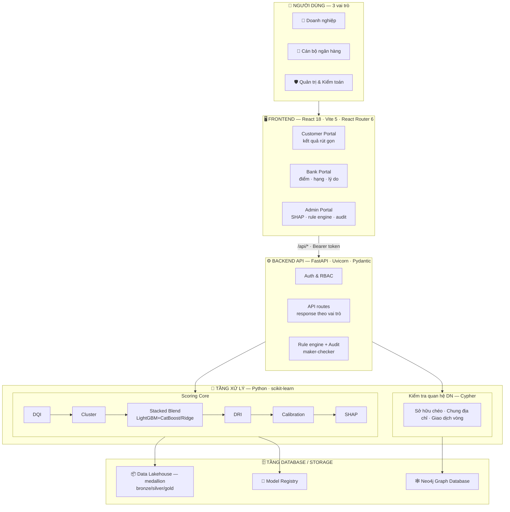

# ScoreSight — Hệ thống Chấm điểm Tín dụng MSME/SME
### Tài liệu thuyết trình tổng hợp: Lý thuyết · Kiến trúc · Hỏi & Đáp

> Chấm điểm tín dụng doanh nghiệp siêu nhỏ/nhỏ/vừa (MSME) tại Việt Nam,
> ưu tiên **dữ liệu phi truyền thống** (hóa đơn điện tử, sao kê, thuế/BHXH, ESG).
> Một MSME thiếu CIC/BCTC **vẫn được chấm** trong khung phù hợp với dữ liệu nó thực sự có.

---

## MỤC LỤC

1. [Tóm tắt điều hành](#1-tóm-tắt-điều-hành)
2. [Bài toán & Ý tưởng cốt lõi](#2-bài-toán--ý-tưởng-cốt-lõi)
3. [Kiến trúc tổng thể & Công nghệ](#3-kiến-trúc-tổng-thể--công-nghệ)
4. [Lý thuyết chấm điểm](#4-lý-thuyết-chấm-điểm)
5. [Kiểm tra quan hệ doanh nghiệp (Graph)](#5-kiểm-tra-quan-hệ-doanh-nghiệp-graph)
6. [Kết quả & Số liệu](#6-kết-quả--số-liệu)
7. [Hỏi & Đáp (Q&A)](#7-hỏi--đáp-qa)

---

## 1. TÓM TẮT ĐIỀU HÀNH

**Vấn đề:** ~98% doanh nghiệp VN là MSME, nhưng gần một nửa **thiếu CIC/BCTC** → bị hệ thống tín dụng truyền thống loại bỏ dù vẫn hoạt động lành mạnh.

**Giải pháp:** chấm điểm dựa trên **dấu chân số thực tế** (hóa đơn điện tử, dòng tiền ngân hàng, tuân thủ thuế/BHXH, ESG) + phân nhóm theo chất lượng dữ liệu + mô hình ML stacked blend + kiểm tra quan hệ doanh nghiệp bằng graph.

**Điểm khác biệt:**
- ✅ Bao phủ thin-file (DN thiếu dữ liệu truyền thống vẫn chấm được)
- ✅ Chống "điểm ảo" bằng DRI + cross-validation giữa các nguồn
- ✅ Giải thích được 100% (SHAP + bằng chứng graph)
- ✅ 3 portal phân quyền (DN / Cán bộ NH / Kiểm toán)

---

## 2. BÀI TOÁN & Ý TƯỞNG CỐT LÕI

### Nguyên tắc thiết kế scorecard — MECE (không trùng lặp)

Mỗi lớp đo **một loại rủi ro khác biệt**:

| Lớp | Câu hỏi rủi ro | Điểm | Bản chất dữ liệu |
|-----|----------------|------|------------------|
| **L1 — CIC** | Lịch sử trả nợ với TCTD? | 200 | Quá khứ tín dụng |
| **L2 — BCTC** | Năng lực tài chính nội tại? | 300 | Cấu trúc tài chính |
| **L3 — Phi truyền thống** | Đang vận hành & tuân thủ tốt? | 500 | Dấu chân số thời gian thực |

**Quy tắc chống trùng lặp:**
- Khả năng trả nợ → **chỉ** đo bằng DSCR (L2). Sao kê ở L3 chỉ đo **độ ổn định** dòng tiền.
- Lịch sử trả nợ → **chỉ** ở CIC (L1). Thuế/BHXH ở L3 đo **nghĩa vụ ngoài tín dụng**.
- Doanh thu → biến **phân khúc/chuẩn hóa**, không tính điểm 2 lần.

### Pipeline 6 bước

```
CompanyBundle (dữ liệu thô 6 nguồn)
 → [1] DQI         đo chất lượng từng nguồn → vector [0,1]⁶
 → [2] Cluster     phân 4 nhóm theo DQI(CIC), DQI(BCTC)
 → [3] ML Blend    score = w·global(x) + (1-w)·cluster(x) ∈ [0,1000]
 → [4] SHAP        top-3 yếu tố ảnh hưởng
 → [5] DRI         final = raw × (0.7 + 0.3·DRI)
 → [6] Rating      master scale + trần cluster + hard-stop → AAA..D
```

---

## 3. KIẾN TRÚC TỔNG THỂ & CÔNG NGHỆ

### 3.1 Sơ đồ kiến trúc



### 3.2 Bảng công nghệ

| Tầng | Công nghệ | Vai trò |
|------|-----------|---------|
| **Frontend** | React 18 · Vite 5 · React Router 6 | SPA 3 portal, routing phân quyền |
| **Backend API** | FastAPI · Uvicorn · Pydantic | HTTP, validate, auth, CORS |
| **Scoring ML** | LightGBM · CatBoost · scikit-learn (Ridge) | Stacked blend auto-select |
| **Giải thích** | SHAP (TreeExplainer) | Top yếu tố từng quyết định |
| **Quan hệ DN** | Neo4j Aura · Cypher · neo4j driver | Kiểm tra sở hữu chéo / chung địa chỉ / giao dịch vòng |
| **Xử lý dữ liệu** | pandas · numpy · pyarrow | Feature engineering, batch scoring |
| **Model Registry** | joblib | Lưu model bundle (`*.pkl`) |
| **Ngôn ngữ** | Python 3 · JavaScript | — |

---

## 4. LÝ THUYẾT CHẤM ĐIỂM

### 4.1 DQI — Data Quality Index (chất lượng dữ liệu)

Đo **chất lượng từng nguồn** → vector 6 chiều ∈ [0,1]. Dùng để **phân cluster**.

```
DQI_overall = 0.25·CIC + 0.25·BCTC + 0.15·eInvoice + 0.15·Bank + 0.10·Compliance + 0.10·ESG
```

| Nguồn | Công thức |
|-------|-----------|
| **CIC** | `0.50·group_q + 0.30·util_q + 0.20·tctd_q` |
| **BCTC** | `0.60·depth(số năm/3) + 0.40·completeness(chỉ số chính)` |
| **eInvoice** | `min(1, số_tháng / 12)` |
| **Bank** | `min(1, số_tháng_sao_kê / 12)` |
| **Compliance** | `min(1, max(0.5, lịch_sử_thuế / 24))` |
| **ESG** | có → 1.0 · không → 0.5 |

### 4.2 Cluster — phân 4 nhóm (ngưỡng DQI = 0.50)

| Cluster | Điều kiện | Trần rating | Features |
|---------|-----------|-------------|----------|
| **FULL** | CIC≥0.5 & BCTC≥0.5 | — (tối đa AAA) | 28 |
| **NO_CIC** | CIC<0.5, BCTC≥0.5 | **AA** | 23 |
| **NO_BCTC** | CIC≥0.5, BCTC<0.5 | **A** | 22 |
| **L3_ONLY** | cả hai <0.5 | **BBB** | 17 |

### 4.3 ML — Stacked Blend

```
score = w · global(x)  +  (1 − w) · cluster_model(x)
```

- **Global** (LightGBM, 28 features, NaN-native): nền khử nhiễu, pool toàn bộ data
- **Cluster** (auto-chọn Ridge/LightGBM/CatBoost theo CV): tinh chỉnh riêng nhóm
- **w**: tune trên validation, mỗi cluster một giá trị

| Cluster | Model | w (global) | Ghi chú |
|---------|-------|-----------|---------|
| FULL | Ridge | 0.15 | đủ data → tin cluster 85% |
| NO_BCTC | Ridge | 0.25 | cluster 75% |
| L3_ONLY | Ridge | 0.70 | ít data → tin global 70% |
| NO_CIC | Ridge | 0.75 | ít data nhất → global 75% |

**Luồng huấn luyện:**
```
5000 DN → split 80/20 (stratify cluster)
 [1] Auto-select model mỗi cluster (5-fold CV)
 [2] Tune blend weight w (trên validation)
 [3] Refit toàn bộ 5000 → lưu *.pkl + blend.json
 [4] Calibrate master scale theo phân phối điểm
```

### 4.4 DRI — Data Richness Index (chống điểm ảo)

```
DRI = 0.35·Coverage + 0.30·Depth + 0.15·Freshness + 0.20·CrossValidation
final_score = raw × (0.7 + 0.3 × DRI)
```
→ DRI=0 vẫn giữ 70% điểm; DRI=1 giữ 100%.

| Thành phần | Đo gì |
|------------|-------|
| **Coverage** | Có bao nhiêu nguồn (CIC/BCTC trọng số 2) |
| **Depth** | Độ sâu lịch sử (HĐĐT, bank, thuế, BCTC) |
| **Freshness** | Dữ liệu có mới không |
| **Cross-Validation** | Các nguồn khớp nhau không (BCTC rev ≈ eInvoice rev ≈ Bank inflow; BHXH ≈ nhân viên) |

> **Cross-validation** = chống khai khống: doanh thu BCTC lệch xa hóa đơn thực → DRI giảm → điểm bị chiết khấu.

### 4.5 Rating — Master Scale (calibrated)

| Hạng | Điểm | Hành động | Tỉ lệ |
|------|------|-----------|-------|
| AAA | 800-1000 | auto_approve | 0.8% |
| AA | 720-800 | auto_approve | 3.7% |
| A | 620-720 | auto_approve | 11.6% |
| BBB | 510-620 | conditional_approve | 19.8% |
| BB | 420-510 | manual_review | 21.7% |
| B | 340-420 | senior_review | 18.1% |
| CCC | 270-340 | auto_reject | 12.4% |
| D | <270 | auto_reject | 12.0% |

**Hard-stops (override bất kể điểm):**
- CIC nhóm nợ 4-5 → **D**
- Sở hữu chéo + giao dịch vòng → **D**
- Cưỡng chế thuế / ô nhiễm nghiêm trọng → trần **BB**
- Sở hữu chéo đơn lẻ → giảm **1 bậc**

---

## 5. KIỂM TRA QUAN HỆ DOANH NGHIỆP (GRAPH)

### Công nghệ
**Neo4j Aura** (graph database) + **Cypher** (pattern matching). Bản chất là **so khớp mẫu đồ thị** — rule-based, không phải ML.

### Mô hình đồ thị
```
(:Company {mst, phan_khuc, nganh, rating, final_score})
(:Owner   {id, ten, flag})
(:Owner)-[:OWNS]->(:Company)          # sở hữu hợp lệ (có thể chung chủ = business group)
(:Owner)-[:OWNS_CROSS]->(:Company)    # sở hữu chéo ẩn (tín hiệu rủi ro)
(:Company)-[:TRADE]->(:Company)       # đối tác thương mại (chuỗi cung ứng)
(:Company)-[:SAME_ADDRESS]->(:Company)
(:Company)-[:INTERNAL_TXN]->(:Company)
```

### 3 mẫu quan hệ rủi ro
| Pattern | Cách phát hiện (Cypher) | Risk |
|---------|------------------------|------|
| Sở hữu chéo ẩn | 1 chủ nắm chéo ≥2 DN | 0.45 |
| Giao dịch vòng | `INTERNAL_TXN*1..10` quay về chính nó | 0.55 |
| Chung địa chỉ | `SAME_ADDRESS` với DN khác | 0.30 |

### Giá trị phân tích (graph giàu liên kết — 18.546 quan hệ, bậc TB 3.7)
1. **Business group:** 1 chủ nắm tới 20 DN → soi rủi ro tập trung theo chủ sở hữu
2. **Anchor hub:** DN có 170+ đối tác → điểm nút quan trọng chuỗi cung ứng
3. **Rủi ro lây lan:** DN hạng A giao dịch với nhiều đối tác CCC/D → cảnh báo

> **Phân biệt then chốt:** `OWNS` = sở hữu khai báo hợp lệ (chung chủ OK); `OWNS_CROSS` = sở hữu chéo ẩn minority (rủi ro). Hệ thống phân biệt **business group hợp pháp** với **shell che giấu**.

---

## 6. KẾT QUẢ & SỐ LIỆU

| Chỉ số | Giá trị |
|--------|---------|
| Tổng công ty | 5.000 |
| Micro / Small / Medium | 2.481 / 1.713 / 806 |
| CIC / BCTC / eInvoice có data | 72.3% / 54.8% / 90.7% |
| Cluster FULL/NO_CIC/NO_BCTC/L3_ONLY | 1.970 / 772 / 1.214 / 1.044 |
| Graph | 8.712 nodes · 18.546 edges · 297 business group · bậc TB 3.7 |

**So sánh kiến trúc ML (test MAE):**

| Kiến trúc | Test MAE | vs global |
|-----------|----------|-----------|
| Global LightGBM | 42.1 | baseline |
| Pure router | 42.4 | −0.6% (thua) |
| **Stacked blend** | **39.7** | **+5.7%** |

→ Sai số ±39.7 điểm trên thang 1000 = **±4%** — đủ chính xác để phân hạng tin cậy.

---

## 7. HỎI & ĐÁP (Q&A)

### Về dữ liệu & ý tưởng

**Q: Vì sao dùng dữ liệu phi truyền thống thay vì CIC/BCTC?**
A: Gần 50% MSME thiếu CIC/BCTC nhưng vẫn hoạt động thật. Dấu chân số (hóa đơn điện tử, dòng tiền, tuân thủ thuế) phản ánh sức khỏe vận hành real-time, giúp chấm được nhóm thin-file mà ngân hàng truyền thống bỏ sót.

**Q: Dữ liệu là thật hay synthetic?**
A: Bản demo dùng **5.000 DN synthetic** sinh từ thống kê thật của VN (GSO/SBV/GDT) — phân bổ ngành, tỉnh, tỉ lệ tuân thủ đều theo anchor thực tế. Kiến trúc giữ nguyên khi cắm data thật vào (chỉ cần thay nguồn + retrain).

**Q: Làm sao xử lý DN thiếu dữ liệu (thin-file)?**
A: 3 cơ chế: (1) **Cluster** xếp DN vào nhóm phù hợp với dữ liệu nó có; (2) **phân bổ lại điểm** từ lớp thiếu sang lớp khác; (3) **DRI** chiết khấu điểm khi dữ liệu mỏng → không cho "điểm ảo".

### Về mô hình ML

**Q: Vì sao blend chứ không dùng 1 model?**
A: Thực nghiệm cho thấy pure-router (mỗi cluster 1 model riêng) **thua** global khi quần thể đồng nhất. Blend kết hợp global (ổn định, pool toàn bộ data) + cluster (chuyên biệt) → tốt hơn cả hai (+5.7% MAE).

**Q: Vì sao Ridge thắng mà vẫn để CatBoost/LightGBM trong hệ thống?**
A: Data synthetic xây từ công thức scorecard **tuyến tính** → quan hệ feature-target tuyến tính → Ridge khớp tự nhiên. Nhưng `registry.py` giữ cả 3 ứng viên + **auto-select theo CV** → khi cắm data thật (PD lịch sử, phi tuyến) hệ thống tự chuyển sang CatBoost/LightGBM. Không cứng nhắc.

**Q: Master scale calibrate thế nào?**
A: Chạy score() trên toàn bộ 5.000 DN → lấy phân phối điểm thực → dịch ngưỡng rating sao cho khớp **credit pyramid thực tế** ngành NH (ít DN tốt ở đỉnh, nhiều ở giữa). Tự động bởi `ml/calibrate.py`, không hardcode.

**Q: Model có giải thích được không?**
A: Có — **SHAP** cho mọi quyết định, trả về top-3 yếu tố + chiều tác động (vd "DSCR=1.4 → tăng 60đ"). Cổng kiểm toán xem SHAP đầy đủ; cổng cán bộ xem lý do rút gọn theo tiêu chí.

**Q: Model có bị bias không?**
A: Scorecard thiết kế MECE để tránh double-count. Không dùng biến nhạy cảm (giới tính, tôn giáo...). DRI đảm bảo DN ít data không bị phạt oan (giữ tối thiểu 70% điểm). Mọi quyết định audit được qua SHAP.

### Về graph / quan hệ DN

**Q: Vì sao không dùng GNN (Graph Neural Network)?**
A: MSME thiếu **data nhãn fraud lịch sử** để train GNN. Rule-based Cypher cho kết quả **giải thích được ngay** (mỗi flag có bằng chứng là đường đi cụ thể trong graph), không cần nhãn. Kiến trúc Neo4j sẵn sàng nâng cấp lên GDS/GNN khi có đủ nhãn.

**Q: Phân biệt business group hợp pháp với shell che giấu thế nào?**
A: Hai loại quan hệ khác nhau: `OWNS` = sở hữu **khai báo, majority** (chung chủ = business group, hợp lệ); `OWNS_CROSS` = sở hữu **chéo ẩn, minority không khai** (tín hiệu rủi ro). Detector chỉ cờ loại thứ hai.

**Q: Graph dùng làm gì ngoài bắt rủi ro?**
A: Soi **rủi ro tập trung** (1 chủ nắm nhiều DN), **rủi ro chuỗi cung ứng** (đối tác hạng xấu), **anchor hub** (DN trọng yếu trong mạng lưới). 18.546 quan hệ, bậc TB 3.7/DN.

### Về kiến trúc & vận hành

**Q: "Data Lakehouse" là có thật hay aspirational?**
A: Trung thực — bản hackathon lưu bằng **file** (JSON theo layer + CSV). Thiết kế **theo chuẩn medallion** (bronze raw → silver clean → gold curated) để scale lên Delta Lake/Iceberg trong production. Đây là kiến trúc hướng tới, không phải đã triển khai đầy đủ.

**Q: Bảo mật / quyền riêng tư dữ liệu?**
A: Privacy by design — 3 portal phân quyền (DN chỉ thấy kết quả rút gọn, không thấy điểm/SHAP/rule). Dữ liệu nhạy cảm (CIC, thuế) yêu cầu consent DN. Maker-checker cho thay đổi ngưỡng (2 người duyệt).

**Q: Hệ thống chạy real-time không?**
A: Có — một đường scoring dùng chung cho cả batch (chấm 5.000 DN lúc khởi động) lẫn hồ sơ mới nộp (single-row inference < 1s). Graph query real-time qua Cypher.

**Q: Production hóa cần gì thêm?**
A: (1) Thay data synthetic bằng feed thật + consent; (2) PD lịch sử làm target thay health_score; (3) Lakehouse thật (Delta/Iceberg); (4) Persistent session/audit (hiện in-memory); (5) Monitoring drift mô hình; (6) GDS/GNN khi có nhãn fraud.

**Q: Hard-stop là gì, vì sao cần?**
A: Quy tắc cứng override điểm số — vd nợ CIC nhóm 4-5 → D ngay bất kể điểm cao. Đảm bảo chính sách tín dụng/pháp lý luôn được tôn trọng, không để ML "ghi đè" rủi ro nghiêm trọng.

---

> **Tài liệu liên quan:** [ARCHITECTURE.md](ARCHITECTURE.md) (kiến trúc chi tiết) ·
> [docs/09_present_scoring.md](docs/09_present_scoring.md) (công thức đầy đủ) ·
> [Credit_Scorecard_SME_3Layers-1.md](Credit_Scorecard_SME_3Layers-1.md) (scorecard gốc)
