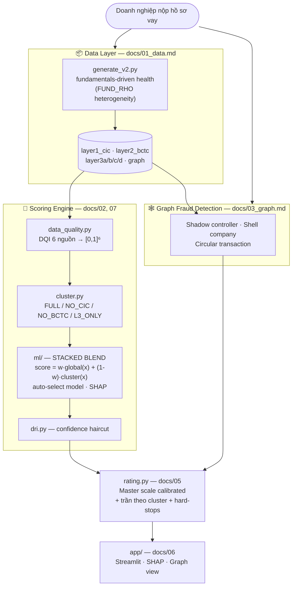

# Hệ thống Chấm điểm Tín dụng MSME/SME

> Hackathon — Chấm điểm tín dụng doanh nghiệp siêu nhỏ, nhỏ và vừa tại Việt Nam
> Trọng tâm: **dữ liệu phi truyền thống** (hóa đơn điện tử, sao kê ngân hàng, tuân thủ thuế/BHXH, ESG)

**Ý tưởng cốt lõi:** chấm **chất lượng dữ liệu (DQI)** → **phân nhóm** theo mẫu dữ liệu có sẵn
→ chấm điểm bằng **stacked blend** (global model + mô hình chuyên biệt từng nhóm) → giải thích **SHAP**
→ **master scale** calibrated. Một MSME thiếu CIC/BCTC vẫn được chấm trong khung phù hợp với dữ liệu nó thực sự có.

---

## Kiến trúc hệ thống



---

## Pipeline chấm điểm (chi tiết)

```
CompanyBundle
 → [1] DQI scoring         scorer/data_quality.py   6 nguồn → vector chất lượng
 → [2] Cluster             scorer/cluster.py        DQI(CIC),DQI(BCTC) vs 0.5 → 4 nhóm
 → [3] Stacked blend       ml/predict.py            w·global(x) + (1-w)·cluster(x)
 → [4] SHAP explanation    ml/predict.py            top-3 yếu tố (tree/linear)
 → [5] DRI haircut         scorer/dri.py            × (0.7 + 0.3·DRI)
 → [6] Master scale        scorer/rating.py         calibrated + trần cluster + hard-stop
```

**Vì sao blend chứ không pure-router?** Thực nghiệm (`python -m ml.compare`): pure per-cluster
router THUA global khi quần thể đồng nhất, nhưng **blend = global + cluster THẮNG** (+5.4% MAE test
với FUND_RHO=0.40). Global pool data khử nhiễu; cluster model tinh chỉnh riêng nhóm. Chi tiết:
[docs/07_ml_cluster.md](docs/07_ml_cluster.md).

---

## Tổ chức dự án — Modular Monolith

```
credit_scoring/
├── data/              ← DATA MODULE     (public: load_company, load_all_flat, list_msts)
│   ├── config.py          anchors GSO/SBV/GDT
│   └── generate_v2.py     2-stage gen, fundamentals-driven health
├── scorer/            ← SCORING MODULE  (public: score(bundle) -> ScoreReport)
│   ├── data_quality.py    DQI profile
│   ├── cluster.py         phân nhóm theo DQI + cluster configs (caps)
│   ├── dri.py             Data Richness Index
│   ├── rating.py          master scale + hard stops
│   ├── engine.py          orchestrator (blend ML + rule fallback)
│   └── layers/            6 rule scorers (fallback + display)
├── ml/                ← ML MODULE
│   ├── features.py        feature extraction per cluster
│   ├── registry.py        model candidates + auto-select + SHAP
│   ├── train.py           global + cluster + blend weights
│   ├── predict.py         blended inference + SHAP
│   ├── calibrate.py       master scale calibration
│   ├── compare.py         global vs router vs blend
│   └── models/            *.pkl + blend.json + master_scale.json
├── graph/             ← GRAPH MODULE    Neo4j + Cypher (public: analyze(mst) -> FraudReport)
│   ├── connection.py      driver (env-config)
│   ├── queries.py         Cypher: schema · load · 3 fraud patterns
│   ├── loader.py          graph.json → Neo4j
│   └── detector.py        Cypher → FraudReport
├── app/               ← UI MODULE       (streamlit run app/main.py)            [TODO]
├── .env.example       ← Neo4j credentials template (Aura)
└── docs/              ← tài liệu thiết kế
```

---

## Tài liệu chi tiết

| File | Module | Mô tả | Trạng thái |
| ---- | ------ | ----- | ---------- |
| [docs/01_data.md](docs/01_data.md) | `data/` | Generator · schema · API | ✅ Xong |
| [docs/02_scoring.md](docs/02_scoring.md) | `scorer/` | Rules 3 lớp (fallback) · ScoreReport | ✅ Xong |
| [docs/07_ml_cluster.md](docs/07_ml_cluster.md) | `scorer/`, `ml/` | DQI · cluster · stacked blend · SHAP | ✅ Xong |
| [docs/04_dri.md](docs/04_dri.md) | `scorer/dri.py` | DRI 4 thành phần | ✅ Xong |
| [docs/05_rating.md](docs/05_rating.md) | `scorer/rating.py` | Master scale · hard stops · LTV | ✅ Xong |
| [docs/03_graph.md](docs/03_graph.md) | `graph/` | Neo4j · Cypher · 3 fraud patterns | ✅ Verify online (Aura) |
| [docs/06_ui.md](docs/06_ui.md) | `app/` | Streamlit · graph view | 🔨 Spec |
| [Credit_Scorecard_SME_3Layers-1.md](Credit_Scorecard_SME_3Layers-1.md) | — | Scorecard spec gốc | ✅ Tham chiếu |

---

## Tiến độ

```
[✅] Scorecard spec (3 lớp, 1000đ, DRI, hard-stop)
[✅] Statistical anchors (GSO/SBV/GDT)
[✅] Data generator v2 (5.000 công ty, fundamentals-driven health)
[✅] DQI + cluster classification (4 nhóm theo chất lượng dữ liệu)
[✅] Scoring engine — stacked blend (global + per-cluster + blend weights)
[✅] SHAP explanation (tree + linear)
[✅] DRI calculator + master scale calibration
[✅] Rating + hard stops + cluster caps
[✅] Thực nghiệm so sánh global/router/blend
[✅] Graph fraud detection — Neo4j + Cypher (shadow controller · shell · circular)

[✅] Graph verify online — Neo4j Aura: nạp 5000 DN + 6078 quan hệ, fraud detect chạy thật

[ ]  Streamlit UI
[ ]  PDF/XML parsers (upload thật)
```

> **Trạng thái graph:** ✅ Đã verify online trên Neo4j Aura. `graph/connection.py` tự nạp
> `.env` (copy từ `.env.example`). Nạp dữ liệu: `python -m graph.loader --clear`; kiểm tra:
> `python -m graph.smoke_test`.

---

## Quick start

```bash
# 1. Sinh dữ liệu (5.000 công ty)
python data/generate_v2.py

# 2. Train models (global + 4 cluster + blend weights)
python -m ml.train

# 3. Calibrate master scale theo phân phối điểm
python -m ml.calibrate

# 4. (tuỳ chọn) So sánh kiến trúc: global vs router vs blend
python -m ml.compare

# 5. Chấm điểm trong Python
python -c "from data import load_company, list_msts; from scorer import score; \
print(score(load_company(list_msts()[0])))"

# 6. Graph fraud (Neo4j Aura)
# Copy .env.example → .env, điền credentials từ console.neo4j.io
export NEO4J_URI="neo4j+s://<id>.databases.neo4j.io"
export NEO4J_USERNAME="<username>"
export NEO4J_PASSWORD="<password>"
export NEO4J_DATABASE="<database>"
python -m graph.loader --clear       # nạp graph.json → Aura
python -m graph.smoke_test           # kiểm tra phát hiện gian lận
# Chấm điểm kèm fraud flags:
#   from graph import analyze; from scorer import score
#   score(bundle, fraud_flags=analyze(mst).fraud_flags)

# 7. [TODO] Demo UI
streamlit run app/main.py
```

> Lưu ý: chạy lại `ml.train` rồi `ml.calibrate` sau mỗi lần regenerate dữ liệu.

---

## Thống kê dataset & kết quả hiện tại

| Chỉ số | Giá trị |
| ------ | ------- |
| Tổng công ty | 5.000 |
| Phân bổ Micro / Small / Medium | 2.481 / 1.713 / 806 |
| CIC / BCTC / E-Invoice có dữ liệu | 72.3% / 54.8% / 90.7% |
| Cluster FULL / NO_CIC / NO_BCTC / L3_ONLY | ~1970 / 772 / 1214 / 1044 |
| Graph | 8.712 nodes · 18.546 edges · 297 business group · bậc TB 3.7 · ~6% rủi ro |

**Phân phối rating (qua engine, credit pyramid thực tế):**

| AAA | AA | A | BBB | BB | B | CCC | D |
| --- | -- | - | --- | -- | - | --- | - |
| 1% | 4% | 12% | 20% | 22% | 18% | 12% | 12% |

**So sánh kiến trúc** (test nghiêm ngặt, `python -m ml.compare`, FUND_RHO=0.40):

| Kiến trúc | Test MAE | vs global |
| --- | --- | --- |
| Global LightGBM | 42.1 | baseline |
| Pure router | 42.4 | −0.6% |
| **Stacked blend** | **39.8** | **+5.4%** |
