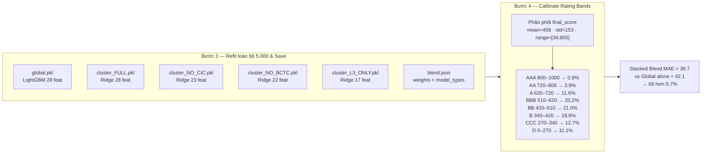

# Giải thích — Bước 3 (Refit & Save) · Bước 4 (Calibrate) · Kết quả

> Hai bước cuối của luồng huấn luyện mô hình, nối tiếp Bước 1 (auto-select model)
> và Bước 2 (tune blend weight). Xem tổng quan train tại [ml/train.py](../ml/train.py).



---

## Bước 3 — Refit toàn bộ 5.000 & Save

Sau khi đã **chọn xong loại model** (Bước 1) và **chọn xong blend weight** (Bước 2)
trên tập train/val, ta train lại lần cuối trên **toàn bộ 5.000 công ty** (không chia
train/val nữa) để model học được nhiều dữ liệu nhất, rồi lưu ra đĩa.

```
global.pkl          ← LightGBM, 28 features → nền khử nhiễu (pool toàn bộ)
cluster_FULL.pkl    ← Ridge, 28 features  (có đủ CIC + BCTC + L3)
cluster_NO_CIC.pkl  ← Ridge, 23 features  (thiếu 5 feature CIC)
cluster_NO_BCTC.pkl ← Ridge, 22 features  (thiếu 6 feature BCTC)
cluster_L3_ONLY.pkl ← Ridge, 17 features  (chỉ còn L3)
blend.json          ← lưu w + loại model mỗi cluster để lúc predict đọc lại
```

**Vì sao số feature khác nhau?** Mỗi cluster bỏ đi nhóm feature mà nó không có dữ liệu:

| Cluster   | Số feature | Tính từ                       |
| --------- | ---------- | ----------------------------- |
| FULL      | 28         | đầy đủ                        |
| NO_CIC    | 23         | 28 − 5 CIC                    |
| NO_BCTC   | 22         | 28 − 6 BCTC                   |
| L3_ONLY   | 17         | 28 − 5 CIC − 6 BCTC           |

---

## Bước 4 — Calibrate Rating Bands

Model giờ cho ra **điểm số [0–1000]**, nhưng cần map điểm → hạng (AAA, AA, ...).
Vấn đề: nếu chọn ngưỡng tùy ý thì phân phối hạng sẽ lệch.

**Cách làm:** chạy `score()` trên cả 5.000 công ty → thu được phân phối điểm thực tế:

```
mean = 459 · std = 153 · range = [34, 905]
```

Rồi **dịch các ngưỡng** sao cho tỉ lệ mỗi hạng khớp với **credit pyramid thực tế**
của ngành ngân hàng (ít DN tốt ở đỉnh, nhiều DN trung bình ở giữa):

| Hạng | Khoảng điểm | Tỉ lệ thực tế |
| ---- | ----------- | ------------- |
| AAA  | 800–1000    | 0.9%          |
| AA   | 720–800     | 3.9%          |
| A    | 620–720     | 11.6%         |
| BBB  | 510–620     | 20.2%  ← phình to ở giữa |
| BB   | 420–510     | 21.0%         |
| B    | 340–420     | 18.6%         |
| CCC  | 270–340     | 12.7%         |
| D    | 0–270       | 11.1%         |

> Đây là lý do điểm 618 của Công ty ABC rơi vào band BBB (510–620).

---

## Kết quả cuối — Stacked Blend MAE = 39.7

So sánh sai số trung bình tuyệt đối (Mean Absolute Error) trên thang 1000 điểm:

```
Global LightGBM một mình : 42.1   (chỉ dùng 1 model cho tất cả)
Stacked Blend            : 39.7   ← tốt hơn 5.7%
```

**Ý nghĩa:** khi kết hợp global model (ổn định, pool toàn bộ data) với cluster model
riêng (chuyên biệt từng nhóm dữ liệu), sai số dự đoán giảm từ ±42 xuống ±40 điểm.
Trên thang 1000 tức là dự đoán lệch trung bình khoảng **±4%** — đủ chính xác để
phân hạng tin cậy.

---

## Tóm lại

| Phần      | Trả lời câu hỏi               |
| --------- | ----------------------------- |
| Bước 3    | "Lưu model production"        |
| Bước 4    | "Biến điểm thành hạng theo phân phối thực" |
| Kết quả   | "Chứng minh blend tốt hơn dùng 1 model" |
